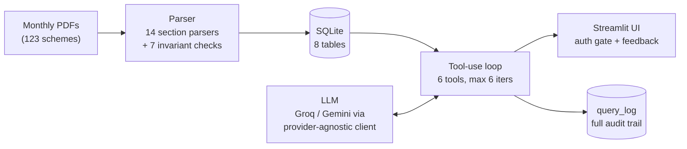

# RM Assist — an LLM research assistant for mutual-fund advisors

Chat with 123 mutual-fund research reports. RM Assist turns a monthly stack of PDF fact sheets into a cited, auditable Q&A tool for Relationship Managers (RMs) — the advisors who field client questions like *"Is this fund a buy?"*, *"Compare X and Y for a conservative investor"*, or *"Should I redeem during this correction?"*

Built solo in ~2 weeks as a working pilot under hard constraints: **zero paid services** (free-tier LLM APIs, SQLite, Streamlit) and an **8 GB MacBook** as both dev machine and host.

## Why not "just RAG"?

Fund reports are overwhelmingly numeric tables. Retrieving table chunks into a prompt and hoping the model reads the right cell is fragile — and cross-fund questions ("top 5 multi-caps by 3Y Sharpe", "funds with expense ratio under 1%") are practically impossible that way. So instead of a vector store, every PDF is **parsed into a normalized SQLite database**, and the model gets **tools instead of chunks**:



At answer time the model never reads numbers out of raw text — every figure comes from SQL over parsed, invariant-checked data. Every answer carries a citation (`Source: <scheme>, as on <date>`) and a standard verification footer, and every query is logged with its full tool trace, model, latency, and token counts.

**The six tools:** `get_full_snapshot` (one-call full picture of a fund: returns, risk, holdings, benchmark alpha), `query_db` (read-only SQL for cross-fund ranking/filtering), `lookup_scheme` (fuzzy name disambiguation), `compare_schemes` (side-by-side tables), `get_market_state` (live NIFTY/Sensex context via yfinance), `get_education_content` (curated FAQ layer).

## Engineering highlights

- **Eval-driven from day 2.** The golden-question spec (40 Q&A pairs across 13 categories, including required refusals) was written *before* the chatbot existed — the eval is the definition of done. Later replaced with a 20-question set built from real advisor queries. Every failure in the calibrated eval is classified (prompt issue / grader brittleness / provider flake) and tracked.
- **Defensive PDF parsing.** 14 section parsers in a dispatch pattern; a failure in one section never kills the parse (partial-snapshot-with-errors). Seven invariants (compositions sum to 100, returns in range, expense ratio sane…) flag suspect data without blocking ingest. Hand-extracted golden fixtures + a `deepdiff` regression baseline catch silent parser drift. All 123 reports ingest cleanly — the handful of remaining warnings were each verified against the source PDFs as data quirks, not parser bugs.
- **Provider-agnostic LLM client.** Groq, Gemini, and Mock backends behind one interface: normalized tool-call shapes, recovery for malformed pseudo-XML tool calls, retry-with-backoff on 429s. Swapping providers is a config change — which mattered when free-tier rate limits forced a mid-project A/B.
- **Latency engineering.** Retired a `get_schema` round-trip by embedding curated DDL in the system prompt, then collapsed the common `lookup → query → query` pattern into the single `get_full_snapshot` call — 30–45% wall-time cuts on typical questions, measured before/after in the eval harness.
- **Retrieval quality.** Word-token overlap scoring for scheme lookup (tolerates word-order swaps, typos, and broker shorthand like "ABSL" → Aditya Birla Sun Life), NULL-trimmed tool payloads (~25% fewer tokens, zero information loss), and an embedding fallback (MiniLM, lazy-loaded, gracefully optional) for paraphrased FAQ matching.
- **Multi-turn without the token bill.** Sliding window keeps the last 3 exchanges verbatim; older turns compact to a one-line heuristic summary — deterministic and instant, no summarization calls.
- **Access control and audit as first-class features.** Nothing renders before bcrypt-backed login. Per-user query logging, thumbs-up/down feedback wired to the audit row, and an operating-mode prompt that draws a deliberate line: answer recommendation-style questions with data, refuse only on `no_data` / `unknown_scheme` / `out_of_scope`.

## By the numbers

| | |
|---|---|
| PDF reports parsed & ingested | 123 / 123 (equity, hybrid, arbitrage, gold, international, debt) |
| Section parsers / data invariants | 14 / 7 |
| Database tables | 8 (snapshots, holdings, sector weights, periodic returns, audit log…) |
| LLM tools | 6 |
| Unit tests | 88 passing (40 token-heavy live-LLM evals run separately) |
| Calibrated real-advisor eval | 7/10, every failure root-caused and tracked |
| Paid services used | 0 |

## Repository map

| Path | What it is |
|---|---|
| [`rm-assist/`](rm-assist/) | The application — parser, DB, retrieval tools, chatbot loop, Streamlit UI, tests |
| [`PLANNING.md`](PLANNING.md) | The full phase plan with acceptance criteria per subtask — kept honest throughout the build |
| [`STATUS.md`](STATUS.md) | Rolling engineering journal: decision rationale, parser postmortems, eval results, latency work |
| `schemes_master.csv` | Seed list of schemes (category, name, source URL) |

The planning docs are left in deliberately — they show the real build: what was decided, what broke, what was measured, and what was cut.

## Running it locally

> **Note on data:** the source reports come from an internal research host whose URL is redacted in this repo (`research-host.example`). Without access to it, the download step won't fetch PDFs — but the full test suite runs regardless (PDF-dependent tests skip gracefully), and the parser works on any report following the same fact-sheet template dropped into `rm-assist/data/pdfs/<YYYY-MM>/`.

```bash
cd rm-assist
python -m venv .venv && source .venv/bin/activate
pip install -r requirements.txt
cp .env.example .env               # add your GROQ_API_KEY (or GEMINI_API_KEY)

python -m db.init_db --force       # create schema + seed schemes
python -m ingest.ingest_month --month 2026-05   # parse PDFs, if you have them

python -m pytest tests/ -q         # 88 tests

# create a login and launch the UI
python -m scripts.create_auth_account --username jane.doe --name "Jane Doe" \
    --email jane.doe@example.com --employee-id RM0001
streamlit run app/streamlit_app.py
```

## Stack

Python 3.11 · pdfplumber + PyMuPDF (parsing) · SQLite (storage) · Groq `gpt-oss-120b` default with Gemini Flash fallback (LLM) · Streamlit + streamlit-authenticator (UI/auth) · yfinance (market context) · sentence-transformers, optional (FAQ matching) · pytest + deepdiff (testing)

## Status

The pilot build is complete through UI, auth, and tunnel hosting (Phases 1–7.2 in [`PLANNING.md`](PLANNING.md)); remaining phases (ops hardening, final eval polish, user onboarding) are documented there. The project has since graduated to a production pilot that continues in a private repository.
